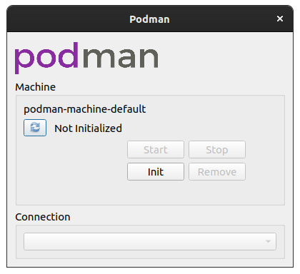
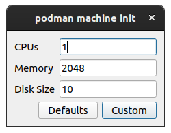
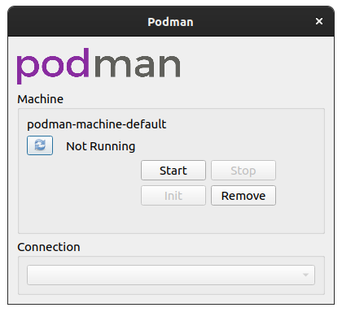
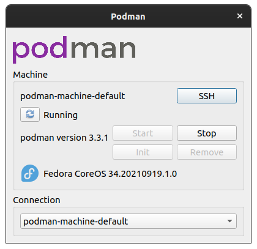
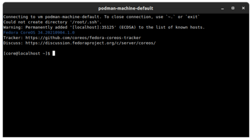

# Podman System Tray Icon

## Running

Open in [Qt Creator](https://doc.qt.io/qtcreator/) GUI:

```shell
qtcreator systray.pro
```

Or on the command line:

```console
$ qmake
$ make
...
$ ./podman-systray
```

## Screenshots

### First launch



### Init parameters




### Not yet running



### Running machine



### SSH console



----

Added the podman logo to the [systray](https://doc.qt.io/qt-5/qtwidgets-desktop-systray-example.html) example, as a proof-of-concept.

See <https://github.com/heyvito/podman-macos> for the macOS version.

Unix builds (Linux, Mac) will need to install qtermwidget dependency:

See <https://github.com/lxqt/qtermwidget> (not available on Windows)
